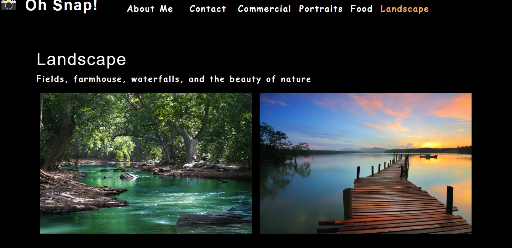

# Title
React App Practice

# Description
This module introduced us to using React.js and had us create a website that highlighted a professional photographers work. The app has
a section about the photographer and gives the user an option where they can contact her if needed. The rest of the applicatoin
has sections that highlight different areas of photography.

# Module Tasks
1. Create an application using React.js
2. Create a header section with sections titled About Me, Contact, Commercial, Portraits, Food, Landscape
3. As I user I can navigate between each section with either of them is clicked
4. Each page has pictures of them showcasing the topic of the page

# Tasks Achieved By
The tasks were achieved by following the module for week 20.

# Application Link
<a href="https://joker282855.github.io/react-app-practice/">Application Link</a>

# Screenshot of Applicaiton

# Contributors
Josh Jackson